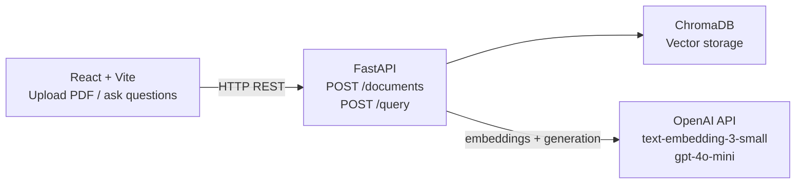

# RAG Document Q&A System

Upload PDFs and ask questions. Returns grounded answers with document citations.

## Architecture

## Tech Stack
- FastAPI, ChromaDB, OpenAI (text-embedding-3-small, gpt-4o-mini), React + Vite
- V3: pgvector, JWT auth, streaming responses

## Getting Started
git clone ...
cp .env.example .env  # add your OpenAI key
pip install -r requirements.txt
python pipeline_test.py

## Project Structure
rag-document-qa/
├── pipeline_test.py   # core RAG loop (V1)
├── backend/           # FastAPI (coming V1)
└── frontend/          # React + Vite (coming V1)

## Known Limitations & Tradeoffs
- Chunking at 500 chars can split section headings from their content,
  degrading retrieval on boundary-spanning answers. Planned fix: larger 
  chunks + overlap in V2.
- Chroma used for V1/V2, migrating to pgvector in V3 for stack consolidation.

## Roadmap
- [ ] V1: pipeline_test.py: working RAG loop (proof of concept)
- [ ] V1: FastAPI wrapper + React UI
- [ ] V2: Multi-doc, chat history, citations
- [ ] V3: Auth, streaming, eval metrics

## Demo
- Screenshots and demo link coming
