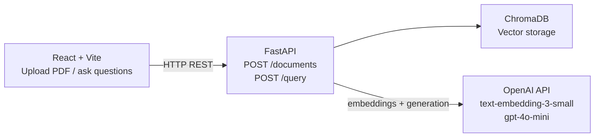

# RAG Document Q&A System

Upload PDFs and ask questions. Returns grounded answers with document citations.

## Architecture

```mermaid
flowchart LR
    A[React + Vite\nUpload PDF / ask questions] -->|HTTP REST| B[FastAPI\nPOST /documents\nPOST /query]
    B --> C[ChromaDB\nVector storage]
    B -->|embeddings + generation| D[OpenAI API\ntext-embedding-3-small\ngpt-4o-mini]
```

## Tech Stack
- FastAPI, ChromaDB, OpenAI (text-embedding-3-small, gpt-4o-mini), React + Vite
- V3: pgvector, JWT auth, streaming responses

## Getting Started
1. Clone the Repo
    git clone ...
    cd rag-document-qa

2. Backend setup
    cd app/backend
    cp .env.example .env  # add your OpenAI key
    pip install -r requirements.txt
    fastapi dev
    # backend running at localhost:8000, docs at localhost:8000/docs

3. Frontend setup (in a new terminal)
    cd app/frontend
    npm install
    npm run dev
    # frontend running at localhost:5173

4. Open localhost:5173 in your browser

## Project Structure
rag-document-qa/
├── docs/
│   └── proof_of_concept/
│       └── pipeline_test.py   # standalone RAG loop validation
├── app/
    ├── backend/                   # FastAPI (/documents, /query)
    └── frontend/                  # React + Vite chat UI

## Known Limitations & Tradeoffs
- Chunking at 500 chars can split section headings from their content,
  degrading retrieval on boundary-spanning answers. Planned fix: larger 
  chunks + overlap in V2.
- Chroma used for V1/V2, migrating to pgvector in V3 for stack consolidation.

## Roadmap
- [X] V1: pipeline_test.py: working RAG loop (proof of concept)
- [X] V1: FastAPI backend (/documents, /query)
- [X] V1: React + Vite frontend
- [ ] V2: Multi-doc, chat history, citations
- [ ] V3: Auth, streaming, eval metrics

## Demo
- Screenshots and demo link coming
